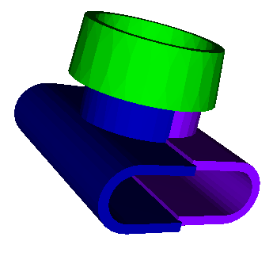

# Ducretet L.024

## Fixation des Lampes

Embases pour les LEDs d'ambiance.
Embases pour les ampoules E10 (6.3v).

Réalisé sous FreeCad.  
[Fichier STL](BoitierLampe-Ecarteur.stl)  
[Fichier STL](BoitierLampe-PorteLED.stl)
