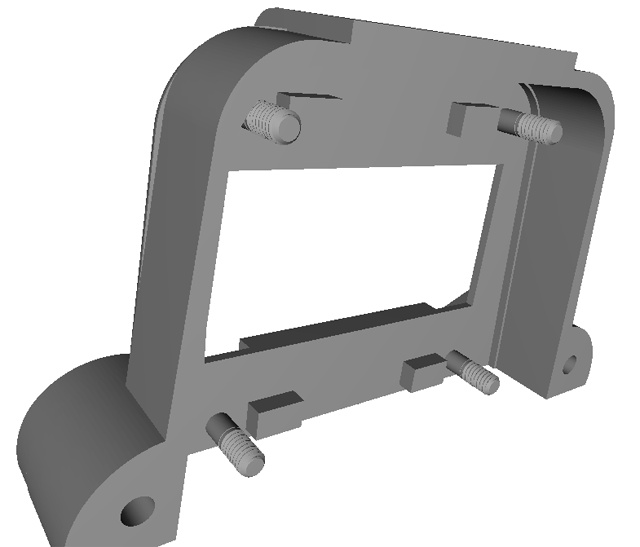

# Ducretet L.024

## Boitier pour écran OLED

L'écran OLED est à l'exterieur et est protégé par un petit boitier ajusté à sa forme.

Réalisé sous FreeCad.

[Fichier STL](BoitierOledUnited-Body.stl)

La version "united" est le boitier en un seul body.
La version précédente (non "united") est composée de deux bodies, devant être collés ou vissés l'un à l'autre, mais possédant chacun une face plane, de façon a pouvoir être imprimés par l'Alfawise. 
