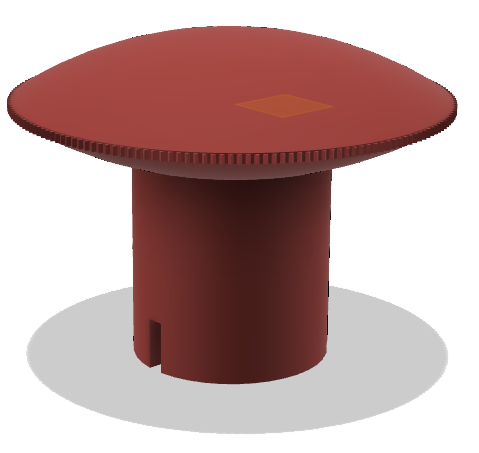

# Ducretet L.024

## Bouton volume

### 

[Fichier STL](BoutonVolume.stl)

Bouton "volume" pour remplacer celui qui est manquant.

En PLA, c'est un peu chip, il faudrait essayer de le faire en résine, mais en obtenant sa couleur *bordeaux*.

Réalisé sous Fusion360.

