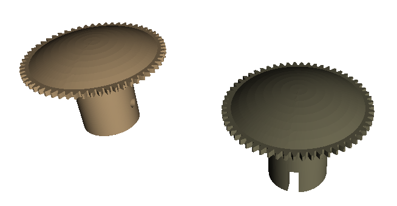

# Ducretet L.024

En PLA, c'est un peu chip, il faudrait essayer de le faire en résine ou ABS, mais en obtenant sa couleur *bordeaux* (voire *noir*).

## Bouton volume

Bouton "volume" pour remplacer celui qui est manquant.  
Réalisé sous FreeCad.

[Fichier STL](Boutons-Volume.stl)

## Bouton Tuning

Bouton "Tuning" pour homogénéïté de l'apparence entre les deux boutons.
Les embases des boutons sont différentes (ronde vs carrée).  
Réalisé sous FreeCad.

[Fichier STL](Boutons-Tune.stl)
