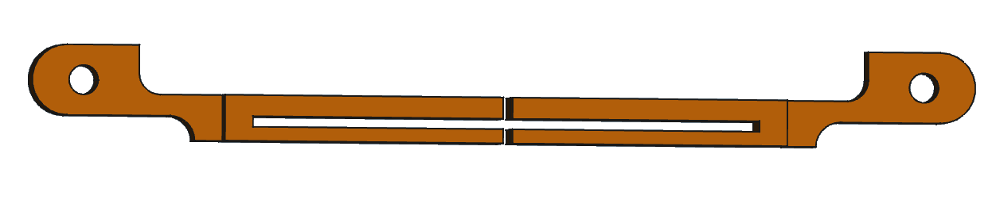

# Ducretet L.024

## Fixation Cadran

Système de fixation de la partie transparente arondie en face avant.  
Cette partie est assez flexible et a besoin d'être maintenue.

Réalisé sous FreeCad.

[Fichier STL](FixationCadran.stl)

