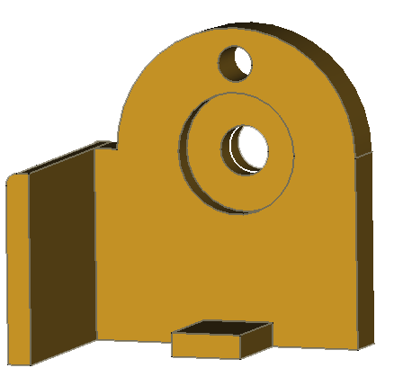

# Ducretet L.024

## Pièces de fixation du potentiomètre de volume

### Socle

[Fichier STL](FixationPotard-Socle.stl)
Réalisé sous FreeCad.

### Mainteneur Axial

[Fichier STL](FixationPotard-MainteneurAxial.stl)
Réalisé sous FreeCad.

