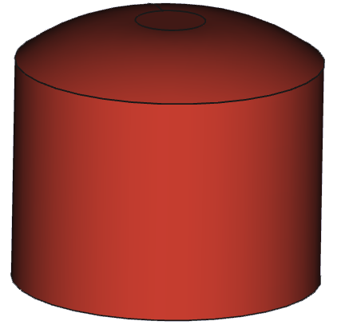

# Ducretet L.024

## Protèges-connecteurs

### 

[Fichier STL](ProtegeConnecteur.stl)

Capuchons pour protéger les pinoches des transistors à lampe vis à vis des autres circuits électroniques.

Réalisé sous Fusion360.
