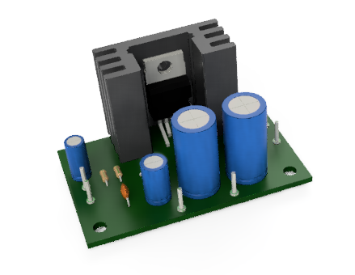

# Ducretet L.024

## Amplifier Board : 3D model

Amplificateur audio mono 4W.

Ce répertoire contient le modèle 3D, réalisé avec Fusion 360 (à l'époque où il y avait une version gratuite).

Le modèle a été exporté au format **step** et au format **stl**.

[Vue du modèle 3D au format STL](Velleman_Amplifier_VM114.stl)

