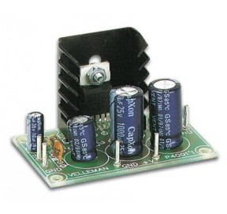

# Ducretet.L024

## Amplifier Board:

Module Amplificateur Audio MONO (7W avec HP 4ohms / 4W avec HP 8ohms).

La nouvelle version de l'amplificateur VM114 est le [WSAH4001](https://www.velleman.eu/products/view/?id=461814)  (kit à souder)  ou  le [WMAH4001](https://www.velleman.eu/products/view/?id=461748)  (version montée).

Ce petit amplificateur a été développé à partir du circuit intégré TDA2003, d'une  puissance maximale de 4Wrms en 4ohm. Ce CI possède une protection  thermique ainsi qu'une protection contre les courts-circuits et les surcharges. Une simple tension continue suffit à l'alimentation. 

## Connectique:

- Audio IN = 2 pins = GND + IN

- Power = 2 pins = GND  +V

- Audio OUT = 2 pins = GND + LS

  

## Caractéristiques:

- Puissance de sortie musicale: 7 W maxi sous 4 ohms.
- Puissance de sortie RMS: 3.5W / 4ohm ou 2W / 8ohm
- Alimentation: 15 Vcc (8 à 18 V autorisés) / 0.5 A.
- Sensibilité d'entrée: 40 mV / 150Kohm
- Distorsion  harmonique totale: 0.05% (1 W / 1 kHz)
- Réponse en fréquence: 20Hz à 20kHz (-3dB)
- Rapport signal/bruit: 86 dB (pondéré en A)
- Dimensions: 55 x 35 mm

## Documentation:

* [Notice d'assemblage en anglais à l'aide d'illustrations, photos, etc.](illustrated_assembly_manual_k4001.pdf) 
* [Notice multilingue pour assemblage du kit](assembly_manual_k4001.pdf)

* [Connection diagram of a 7W amplifier](infosheet_k4001_connection.pdf)
* [Connection diagram of a 7W amplifier with a volume regulator](https://www.velleman.eu/downloads/0/infosheets/infosheet_k4001_connection_volumereg.pdf)
* [Connection diagram of a simple supply for the K4001 amplifier, using a transformer, a rectifier and a capacitor.](https://www.velleman.eu/downloads/0/infosheets/infosheet_k4001_supply.pdf)

## Magasins:

[GoTronic](https://www.gotronic.fr/art-amplificateur-bf-7-w-617.htm) (10€)

