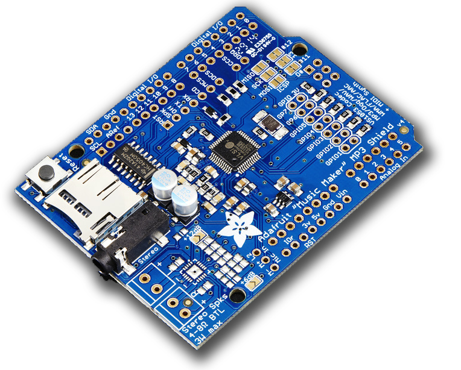

# Adafruit MP3 Player Shield

Cette [carte Player MP3 de Adafruit](https://www.adafruit.com/product/1790) permet de jouer des fichiers MP3 situés sur une carte SD avec une bonne qualité sonore.

La gestion de la carte et du chipset *VS-1053* se fait via une [librairie fournie par Adafruit](https://github.com/adafruit/Adafruit_VS1053_Library).

