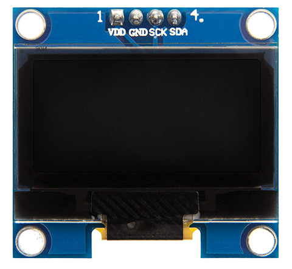

# 1.3" OLED Display I2C 128x64 pixels

## Product information 

Avec une diagonale d'écran de 3,7 cm, l'écran **[OLED AZDelivery 1,3 pouces](https://www.azde.ly/en/products/1-3zoll-i2c-oled-display?_pos=1&_sid=1258277d0&_ss=r)** pour Arduino et Raspberry Pi est très compact, mais aussi très lisible grâce à son contraste élevé. 

L'écran se compose de **128x64 pixels OLED blancs** qui sont contrôlés individuellement par la puce SH1106 intégrée. Comme les pixels eux-mêmes s'allument, aucun rétroéclairage n'est nécessaire, ce qui a un effet positif sur la consommation d'énergie et donne en outre un contraste élevé à l'écran. 

Il est parfait pour une utilisation facile avec des microcontrôleurs comme Arduino, ATmega, STM32, 8051, AVR, PIC, DSP, ARM, MSP430, PLC, logique TTL, etc. 

L'afficheur est commandé par une **interface I2C** et ne nécessite que 4 connecteurs. Pour une utilisation avec une carte Arduino, nous recommandons la bibliothèque [U8g2](https://github.com/olikraus/U8g2_Arduino) (by Oliver Kraus), qui contient également quelques exemples de croquis, disponible depuis le *PlugIn Manager* de l'IDE Arduino. 

Ce [wiki officiel](https://github.com/olikraus/u8g2/wiki) décrit l'utilisation de la librarie **U8g²** (*U8glib version 2*).

## Technical information

### Pinout

A typical pine-lining with an Arduino looks like this:

* VCC   > 5V
* GND > GND
* SDA  > A4 (Arduino UNO)
* SCL  > A5 (Arduino UNO)

### Details

* Chipset: SH1106
* Low power consumption < 11mA
* Resolution: 128 x 64 pixels
* Operating voltage: from 3.3V to 5V. The chipset uses 3.3v but the board includes a 5v to 3.3v regulator.
* Control: I2C / TWI
* Pine coating: VCC, GND, SCL, SDA
* Dimensions : 36 x 34 x 3mm

### Documents

* [1.3'' OLED I2C Screen ENG](1-3_inch_OLED_I2C_Screen_ENG.pdf)
* [Datasheet](1-3_inch_OLED_Screen_Datasheet.pdf)

## Librairies

Plusieurs librairies Arduino peuvent être utilisées pour piloter ce module:

* **AdaFruit** : Librairie graphique générale **Adafruit_GFX** et la librairie couche-basse **Adafruit_11366**.
* **Sparkfun** : Librairie **Micro_OLED**.
* **Oliver Kraus** : Librairie **u8g2lib** (texte+graphiques) ou librairie **u8x8** (polices 8x8 seulement). 

* U8g2

  - Includes all graphics procedures (line/box/circle draw).
  - Supports many fonts. (Almost) no restriction on the font height.
  - Requires some memory in the microcontroller to render the display.

* U8x8

  - Text output only (character) device.
  - Only fonts allowed with fixed size per character (8x8 pixel).
  - Writes directly to the display. No buffer in the microcontroller required.

*J'ai retenu **U8g2** qui comporte davantages de capacités en ce qui concerne les polices de caractères.*

### Documentation

[Free eBook for download](http://bibliothek.az-delivery.de)

