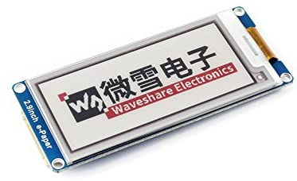
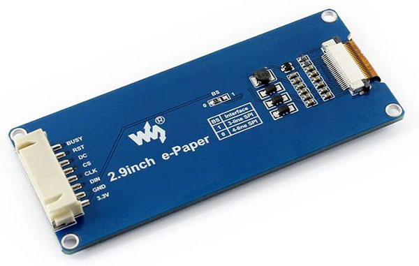
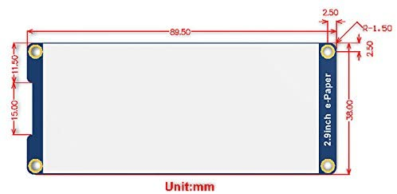

# DUCRETET L.024
## Afficheur ePaper

### Description

**296x128,  2.9inch E-Ink display module, three-color, SPI interface**

This is an E-Ink display module, 2.9inch, 296x128 resolution, with  embedded controller, communicating via **SPI interface**, supports  red, black, and white **three-color** display.

No backlight.
Keeps displaying last content for a long time even when power down.
Ultra low power consumption, basically power is only required for refreshing.
SPI interface, for connecting with controller boards like Raspberry Pi/Arduino/Nucleo, etc.
Wide viewing  angle.

### Specifications

| 1    | 2    | 3        | 4       | 5                   | 6                       | 7                    | 8                               |
| ---- | ---- | -------- | ------- | ------------------- | ----------------------- | -------------------- | ------------------------------- |
| VCC  | GND  | DIN      | CLK     | CS: SPI chip select | DC : Data/Command       | RST : External Reset | BUSY                            |
| 3.3V | GND  | SPI MOSI | SPI CLK | Active Low          | High=Data / Low=Command | Low=Reset            | ouput pin status. High=busy |

* Size: 2.9inch -  296x128 (B)
* Onboard voltage translator, compatible with 3.3V/5V MCUs
* Operating voltage: 3.3V/5V
* Interface: 3-wire SPI, 4-wire SPI
* Outline dimension: 89.5mm x 38mm
* Display size: 66.89mm x 29.05mm
* Dot pitch: 0.138 x 0.138
* Resolution: 296 x 128
* Display color: red,black, white
* Grey level: 2
* Full refresh time: 15s （Do not support partial refresh)
* Refresh power: 26.4mW(typ.)
* Standby power: <0.017mW
* Viewing angle: >170°

### Development Resources

Development resources and manual (examples for  Raspberry Pi/Arduino), download link:

 www.waveshare.com/wiki/2.9inch_e-Paper_Module_(B) 

Demo code : https://github.com/waveshare/e-Paper

There are several SPI communication modes. SPI0 is commonly used, in which CPHL = 0, CPOL = 0.

Because of the small RAM of Arduino, it cannot  support drawing function, therefore, WaweShare only provides image display  function. The image data are stored in flash. 196x128 = 4736 octets = 4.6 kB.

The I/O level of Arduino is 5V, and the e-Paper should be driven with 3V3. If your Arduino cant drive the e-Paper successfully, please try to convert the level to 3.3V. You can also try to connect the Vcc pin to the 5V of Arduino to  see whether the e-Paper works, but we recommend you not to use 5V for a  long time.

Pour créer ses propres polices:

https://wavesharejfs.blogspot.com/2018/08/make-new-larger-font-for-waveshare-spi.html

This is a post in Arduino Form about our SPI e-Paper thanks to ZinggJM, maybe you want to refer to.

https://forum.arduino.cc/index.php?topic=487007.0

Librarie pour Arduino de ZinggJM: 

https://github.com/ZinggJM/GxEPD